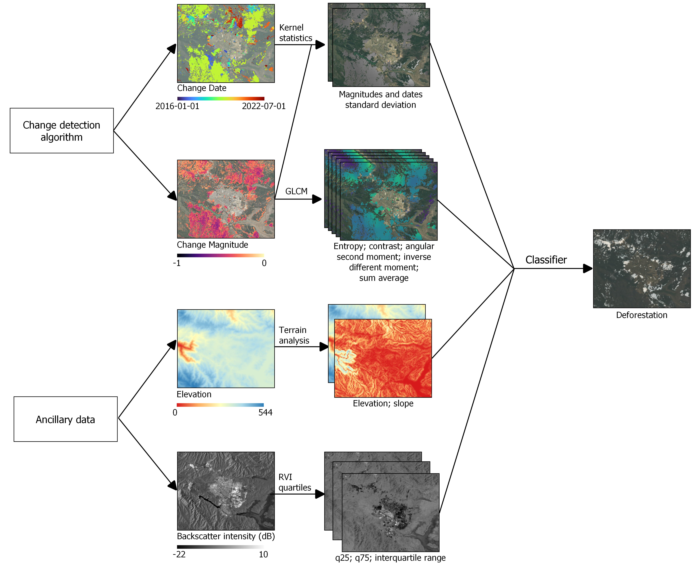

# SAMSARA_UAI

Code associated with the publication entitled [Is the change deforestation? Using time-series analysis of satellite data to disentangle deforestation from other forest degradation causes]([[https://www.sciencedirect.com/science/article/pii/S0098300419306533](https://www.sciencedirect.com/science/article/abs/pii/S2352938524000740)](https://www.sciencedirect.com/science/article/abs/pii/S2352938524000740)) in **Remote Sensing Applications: Society and Environment** by Ignacio Fuentes, Javier Lopatín, Mauricio Galleguillos, Andrés Ceballos-Comisso, Susana Eyheramendy, and Rodrigo Carrasco from Universidad de Las Américas, Universidad Adolfo Ibáñez, and Universidad Católica de Chile.


**doi**: https://doi.org/10.1016/j.rsase.2024.101210


## About

The scripts correspond to Jupyter Notebooks using Python and can be used to disentangle deforestation from other forest disturbances. The code uses Google Earth Engine (GEE) functionality to run temporal segmentations on Lansat collections in Mediterranean environments. Various inputs are developed and different algorithms are tested, including a secondary classification using a random forest model. 

<p align="center">
  
</p>

The code to get inputs is in *getting_inputs_using_CCDC.ipynb*. The classification, cross-validation, and visualisation are in *Classification_disturbances.ipynb*. 

Different algorithms can be obtained using their respective notebooks. PELT and npphen can be obtained by integrating GEE or using other alternatives (datacube). CCDC is implemented in GEE and some functions are included to process their outputs.

<p align="center">
  
</p>


## How to cite this work?

### Article

```
@article{fuentes2024change,
  title={Is the change deforestation? Using time-series analysis of satellite data to disentangle deforestation from other forest degradation causes},
  author={Fuentes, Ignacio and Lopatin, Javier and Galleguillos, Mauricio and Ceballos-Comisso, Andr{\'e}s and Eyheramendy, Susana and Carrasco, Rodrigo},
  journal={Remote Sensing Applications: Society and Environment},
  volume={35},
  pages={101210},
  year={2024},
  publisher={Elsevier}
}
```
